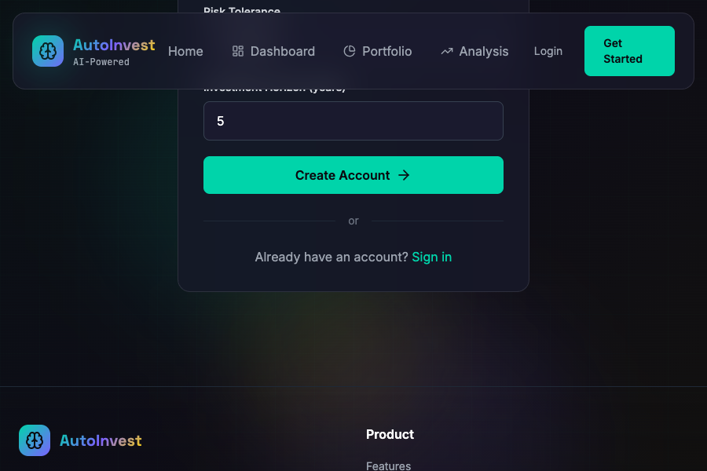
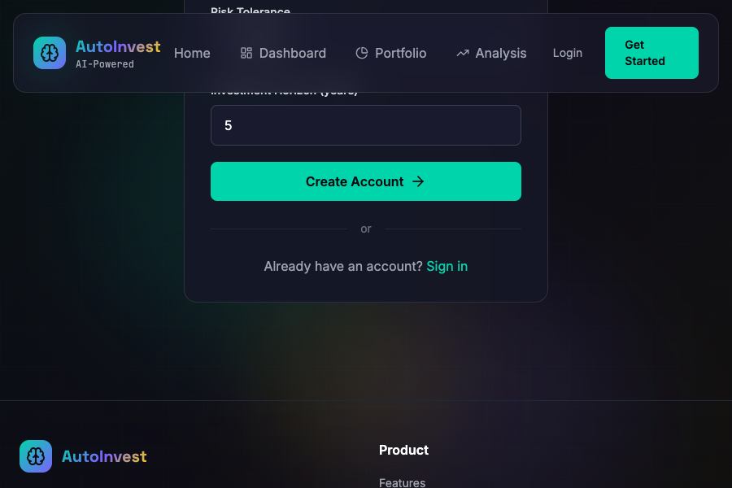
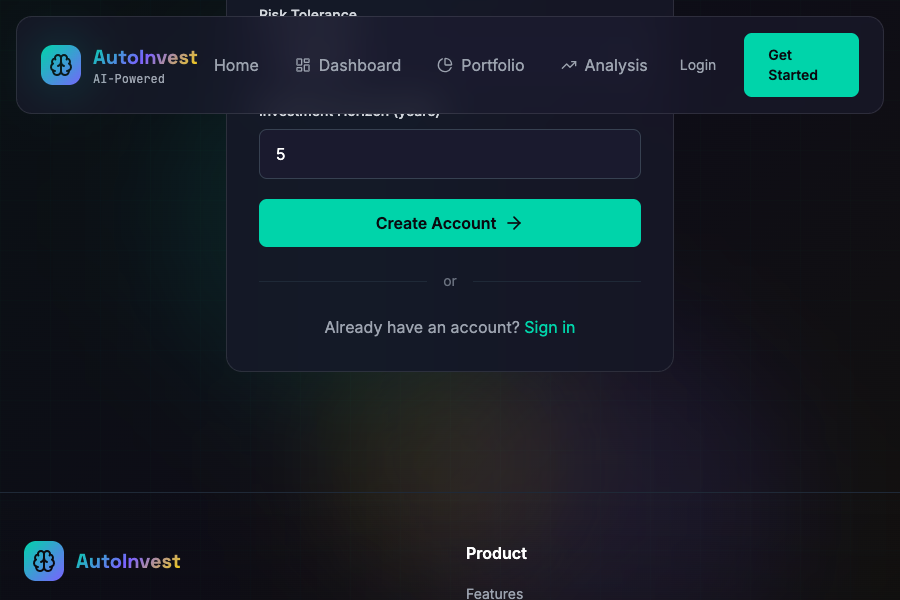

# AI-Driven Auto Investment Platform

**Evaluation Document:** Full Phase 1 / Phase 2 – Review 1 report is available at `docs/Phase1_Review1_Document.md` (updated 08 Feb 2026).

## Current Implementation Snapshot (08 Feb 2026)
- FastAPI backend with JWT + Argon2 authentication and user preference storage.
- Market data service calling Finnhub with async caching for quotes, popular baskets, and market overview.
- Gemini-powered LLM service that returns structured stock/portfolio analyses with explanations.
- React + Vite frontend shell with protected routes, animated UI, and axios interceptors for token refresh.
- Portfolio/analysis/backtest endpoints scaffolded; quantitative engine and optimization logic are stubbed and queued for integration.

---

## 🌐 Live Demo

| Service | URL |
|---------|-----|
| **Frontend (GitHub Pages)** | **https://planav.github.io/ai-auto-investment/** |
| Backend API | Deploy to Render.com — see [Hosting Guide](#-hosting--deployment) |

> The frontend is automatically re-deployed to GitHub Pages every time a commit is pushed to the `main` branch. No manual steps needed.

---

[](https://opensource.org/licenses/MIT)
[](https://www.python.org/downloads/)
[](https://reactjs.org/)
[](https://fastapi.tiangolo.com/)

> **An AI-powered investment decision-support platform leveraging state-of-the-art deep learning models for portfolio optimization and explainable investment recommendations.**

---

## 📋 Table of Contents

- [Overview](#overview)
- [Key Features](#key-features)
- [System Architecture](#system-architecture)
- [Technology Stack](#technology-stack)
- [Project Status](#project-status)
- [Getting Started](#getting-started)
- [Hosting & Deployment](#-hosting--deployment)
- [Documentation](#documentation)
- [Academic Context](#academic-context)
- [Screenshots](#screenshots)
- [Contributing](#contributing)
- [License](#license)

---

## 🎯 Overview

The **AI-Driven Auto Investment Platform** is a comprehensive decision-support system designed to democratize access to sophisticated investment analysis tools. By combining **fundamental analysis**, **sentiment analysis**, and **state-of-the-art deep learning models**, the platform assists retail investors in making informed, data-driven investment decisions.

### Problem Statement

> **How can an intelligent system assist retail investors in analyzing large universes of financial assets and generating optimized, risk-aware investment portfolios using AI techniques while maintaining full transparency and explainability?**

### Key Challenges Addressed

- **Information Overload:** Filtering thousands of financial instruments into actionable insights
- **Analytical Complexity:** Applying institutional-grade quantitative analysis without requiring expertise
- **Portfolio Construction:** Optimizing asset allocation based on risk tolerance and investment goals
- **Explainability:** Providing transparent, understandable rationale for AI-driven recommendations
- **Accessibility:** Making advanced AI tools available to retail investors

---

## ✨ Key Features

### 🤖 AI Research Agent
- **Fundamental Analysis:** Evaluates assets using financial metrics (P/E, P/B, ROE, revenue growth)
- **Sentiment Analysis:** Analyzes market sentiment from news and social media
- **Asset Screening:** Filters and ranks investment candidates based on combined scores
- **Natural Language Explanations:** Generates human-readable rationale for selections

### 📊 Quantitative Engine
- **Multiple Deep Learning Models:**
  - Temporal Fusion Transformer (TFT) for multi-horizon forecasting
  - LSTM with Attention for sequential pattern recognition
  - Graph Neural Networks for asset relationship modeling
  - PatchTST and N-BEATS for time series analysis
- **Return Prediction:** Generates probabilistic forecasts with confidence intervals
- **Feature Importance:** Provides interpretability through attention mechanisms
- **Backtesting Framework:** Evaluates strategy performance on historical data

### 💼 Portfolio Optimization Engine
- **Multiple Optimization Methods:**
  - Mean-Variance Optimization (Markowitz)
  - Risk Parity
  - Equal Risk Contribution
- **Comprehensive Risk Metrics:**
  - Volatility, Sharpe Ratio, Sortino Ratio
  - Value at Risk (VaR), Conditional VaR (CVaR)
  - Maximum Drawdown, Beta
- **Constraint Handling:** Respects user-defined limits and preferences
- **Rebalancing Recommendations:** Detects portfolio drift and suggests adjustments

### 🎨 Modern Web Interface
- **Real-Time Dashboard:** Live market data and portfolio performance
- **Interactive Visualizations:** Performance charts, asset allocation, risk metrics
- **AI Insights Panel:** Confidence-scored recommendations and explanations
- **Responsive Design:** Optimized for desktop and tablet devices
- **Smooth Animations:** Professional UI with Framer Motion

---

## 🏗️ System Architecture

The platform follows a **multi-layered, microservices-inspired architecture**:

```
┌─────────────────────────────────────────────────────────────┐
│                     Client Layer                             │
│              React 18 + Vite + Tailwind CSS                  │
└─────────────────────────────────────────────────────────────┘
                            │
                            ▼
┌─────────────────────────────────────────────────────────────┐
│                   API Gateway Layer                          │
│              FastAPI (Authentication & Routing)              │
└─────────────────────────────────────────────────────────────┘
                            │
                            ▼
┌─────────────────────────────────────────────────────────────┐
│                  Core Services Layer                         │
│    User Service │ Portfolio Service │ Analysis Service      │
└─────────────────────────────────────────────────────────────┘
                            │
                            ▼
┌─────────────────────────────────────────────────────────────┐
│                   AI Engine Layer                            │
│  Research Agent │ Quant Engine │ Portfolio Engine           │
└─────────────────────────────────────────────────────────────┘
                            │
                            ▼
┌─────────────────────────────────────────────────────────────┐
│                     Data Layer                               │
│    PostgreSQL │ Redis Cache │ External Market Data          │
└─────────────────────────────────────────────────────────────┘
```

### Component Responsibilities

| Layer | Components | Responsibilities |
|-------|-----------|------------------|
| **Client** | React Web App | User interface, visualization, state management |
| **API Gateway** | FastAPI | Authentication, routing, request validation |
| **Core Services** | User, Portfolio, Analysis | Business logic, orchestration |
| **AI Engines** | Research, Quant, Portfolio | Asset analysis, prediction, optimization |
| **Data** | PostgreSQL, Redis | Persistent storage, caching |

For detailed architecture documentation, see [`plans/system-architecture.md`](plans/system-architecture.md).

---

## 🛠️ Technology Stack

### Backend
- **Framework:** FastAPI 0.109 (Python 3.10+)
- **Database:** PostgreSQL 15 with SQLAlchemy ORM
- **Cache:** Redis 7
- **Authentication:** JWT with Argon2 password hashing
- **Data Processing:** Pandas, NumPy, SciPy
- **Machine Learning:** PyTorch, Scikit-learn
- **API Client:** httpx, aiohttp (async)

### Frontend
- **Framework:** React 18 with Vite
- **Styling:** Tailwind CSS
- **State Management:** Zustand
- **Routing:** React Router v6
- **Animations:** Framer Motion
- **Charts:** Recharts
- **HTTP Client:** Axios

### DevOps & Tools
- **Database Migrations:** Alembic
- **Code Quality:** Black, isort, flake8, ESLint
- **Testing:** pytest, pytest-asyncio
- **Documentation:** OpenAPI/Swagger (auto-generated)

---

## 📈 Project Status

### ✅ Completed Features (95%)

**Backend:**
- ✅ FastAPI application with async support
- ✅ PostgreSQL database with migrations
- ✅ JWT authentication system
- ✅ User management and preferences
- ✅ Portfolio CRUD operations
- ✅ AI Research Agent (fundamental + sentiment analysis)
- ✅ Quantitative Engine (multiple model architectures)
- ✅ Portfolio Optimization Engine (3 methods)
- ✅ Market data service with caching
- ✅ Comprehensive API endpoints

**Frontend:**
- ✅ React application with routing
- ✅ Authentication flow (login/register)
- ✅ Protected routes
- ✅ Dashboard with live market data
- ✅ Portfolio management interface
- ✅ Interactive charts and visualizations
- ✅ AI insights panel
- ✅ Responsive design
- ✅ Toast notifications

### ⏳ In Progress (40-60%)

- ⏳ LLM integration (Google Gemini API)
- ⏳ Advanced backtesting metrics
- ⏳ Real-time data streaming (WebSocket)
- ⏳ Model training pipeline
- ⏳ Advanced visualizations (heatmaps, factor exposure)
- ⏳ Automated rebalancing execution

### 📋 Planned Features

- 📋 Mobile application (React Native)
- 📋 Social features (portfolio sharing)
- 📋 Advanced strategies (momentum, mean reversion)
- 📋 ESG screening
- 📋 Tax optimization
- 📋 Multi-currency support

---

## 🚀 Getting Started

### Prerequisites

- Python 3.10 or higher
- Node.js 18 or higher
- PostgreSQL 15 or higher
- Redis 7 or higher

### Installation

#### 1. Clone the Repository

```bash
git clone https://github.com/yourusername/autoinvest.git
cd autoinvest
```

#### 2. Backend Setup

```bash
cd backend

# Create virtual environment
python -m venv venv
source venv/bin/activate  # On Windows: venv\Scripts\activate

# Install dependencies
pip install -r requirements.txt

# Set up environment variables
cp .env.example .env
# Generate a SECRET_KEY and add it to .env:
#   openssl rand -hex 32
# Edit .env with your configuration (SECRET_KEY, database URL, API keys)

# Initialize database
alembic upgrade head

# Run development server
uvicorn app.main:app --reload --host 0.0.0.0 --port 8000
```

#### 3. Frontend Setup

```bash
cd frontend/web

# Install dependencies
npm install

# Run development server
npm run dev
```

#### 4. Access the Application

- **Frontend:** http://localhost:5173
- **Backend API:** http://localhost:8000
- **API Documentation:** http://localhost:8000/docs

### Quick Start Guide

1. **Register an Account:** Navigate to `/register` and create an account
2. **Set Preferences:** Complete the onboarding form with your investment preferences
3. **Generate Portfolio:** The AI will analyze assets and create an optimized portfolio
4. **View Dashboard:** Monitor performance, view AI insights, and track holdings
5. **Explore Analysis:** Access detailed risk metrics and AI explanations

For detailed setup instructions, see [`SETUP.md`](SETUP.md).

---

## 🚀 Hosting & Deployment

### Frontend — GitHub Pages (automatic)

The frontend is deployed automatically to **https://planav.github.io/ai-auto-investment/** via the `gh-pages.yml` GitHub Actions workflow.  
Every push to `main` triggers a new build and deploy — nothing manual required.

To enable it for a fork:
1. Go to **Settings → Pages** in your GitHub repository.
2. Set **Source** to **GitHub Actions**.
3. Push a commit to `main` — the workflow will deploy it automatically.

### Backend — Render.com (one-click)

The `render.yaml` Blueprint in this repository lets you deploy the full backend stack (FastAPI + PostgreSQL + Redis) to [Render.com](https://render.com) with a single click.

#### Steps

1. [Sign up at render.com](https://render.com) (free tier available) and connect your GitHub account.
2. Click **New → Blueprint** and select this repository.
3. Set the required secrets in the Render dashboard:

   | Secret | Where to get it |
   |--------|----------------|
   | `SECRET_KEY` | Run: `openssl rand -hex 32` |
   | `GEMINI_API_KEY` | [Google AI Studio](https://aistudio.google.com/) |
   | `FINNHUB_API_KEY` | [finnhub.io](https://finnhub.io/) |
   | `ALPHA_VANTAGE_API_KEY` | [alphavantage.co](https://www.alphavantage.co/) |
   | `NEWS_API_KEY` | [newsapi.org](https://newsapi.org/) |

4. Click **Apply** — Render creates the PostgreSQL database, Redis instance, and backend service.
5. Copy the generated backend URL (e.g. `https://autoinvest-backend.onrender.com`).
6. Add it as a GitHub repository variable named `VITE_API_URL` with the value `https://autoinvest-backend.onrender.com/api/v1`.  
   The next push to `main` will bake that URL into the GitHub Pages frontend.

> After setup, every push to `main` automatically re-deploys **both** the frontend (GitHub Pages) and the backend (Render.com).

### Full-Stack Local Deployment (Docker)

```bash
# 1. Copy and fill in the environment variables
cp .env.example .env
# Edit .env — set SECRET_KEY and any API keys you have

# 2. Start everything
docker compose up --build

# Frontend → http://localhost
# Backend  → http://localhost:8000
# API docs → http://localhost:8000/docs
```

## 📚 Documentation

### Project Documentation

- **[PROJECT_REPORT.md](PROJECT_REPORT.md)** - Comprehensive academic project report (85 pages, ~25,000 words)
  - Abstract and Introduction
  - Literature Review
  - Requirement Specification
  - System Architecture
  - Detailed Design & Algorithms
  - Implementation Overview
  - Current Progress
  - Challenges & Limitations
  - Future Work
  - References (35+ academic papers and books)

- **[SETUP.md](SETUP.md)** - Detailed setup and configuration guide

- **[plans/system-architecture.md](plans/system-architecture.md)** - Technical architecture documentation

- **[plans/implementation-plan.md](plans/implementation-plan.md)** - Development roadmap

- **[plans/data-architecture.md](plans/data-architecture.md)** - Data flow and integration design

### API Documentation

Interactive API documentation is available at:
- **Swagger UI:** http://localhost:8000/docs
- **ReDoc:** http://localhost:8000/redoc

---

## 🎓 Academic Context

This project is developed as a **Final Year Engineering Project** with strong academic and research orientation.

### Research Contributions

1. **Multi-Modal AI Integration:** Combining fundamental analysis, sentiment analysis, and deep learning for investment decisions

2. **Explainable AI in Finance:** Framework for generating natural language explanations of AI-driven recommendations

3. **State-of-the-Art Models:** Application of Temporal Fusion Transformers and Graph Neural Networks to portfolio optimization

4. **Comprehensive System Design:** End-to-end platform demonstrating practical AI implementation in fintech

### Publication Potential

This project provides foundation for research papers in:
- **Financial Machine Learning:** Evaluation of deep learning architectures for financial forecasting
- **Explainable AI:** Methods for generating user-friendly explanations of AI decisions
- **Human-Computer Interaction:** User studies on trust and usability of AI-driven financial tools
- **Portfolio Optimization:** Novel approaches combining AI predictions with optimization theory

### Educational Value

- Demonstrates integration of multiple AI techniques
- Provides hands-on experience with production-grade architecture
- Showcases best practices in software engineering
- Offers platform for experimentation and learning

---

## 📸 Screenshots

### Registration Form

*User registration interface*

### Registration Attempt

*Registration form in action*

### Registration Validation

*Form validation and error feedback*

---

## 🤝 Contributing

We welcome contributions from the community! Here's how you can help:

### Development Workflow

1. **Fork the repository**
2. **Create a feature branch:** `git checkout -b feature/amazing-feature`
3. **Make your changes**
4. **Run tests:** `pytest` (backend) and `npm test` (frontend)
5. **Commit your changes:** `git commit -m 'Add amazing feature'`
6. **Push to the branch:** `git push origin feature/amazing-feature`
7. **Open a Pull Request**

### Coding Standards

- **Python:** Follow PEP 8, use Black for formatting
- **JavaScript:** Follow ESLint configuration
- **Commits:** Use conventional commit messages
- **Documentation:** Update relevant docs with your changes

### Areas for Contribution

- 🐛 Bug fixes and issue resolution
- ✨ New features and enhancements
- 📝 Documentation improvements
- 🧪 Test coverage expansion
- 🎨 UI/UX improvements
- 🔬 Research and experimentation

---

## 📄 License

This project is licensed under the MIT License - see the [LICENSE](LICENSE) file for details.

---

## 🙏 Acknowledgments

- **Project Guide:** [Guide Name] for valuable guidance and feedback
- **Department Faculty:** For providing resources and support
- **Open Source Community:** For excellent libraries and frameworks
- **Research Community:** For publishing foundational work in financial ML

---

## 📞 Contact

For questions, suggestions, or collaboration opportunities:

- **Project Team:** [Your Email]
- **GitHub Issues:** [Project Issues](https://github.com/yourusername/autoinvest/issues)
- **Documentation:** [Project Wiki](https://github.com/yourusername/autoinvest/wiki)

---

## ⚠️ Disclaimer

**IMPORTANT:** This platform is designed for **educational and research purposes only**. It is NOT a licensed investment advisor and does NOT provide personalized financial advice.

- ❌ No guarantees of investment returns
- ❌ Not suitable for live trading with real money
- ❌ Past performance does not indicate future results
- ✅ Always consult licensed financial advisors before making investment decisions
- ✅ Understand the risks involved in investing
- ✅ Use this platform as a learning and decision-support tool only

---

## 🌟 Star History

If you find this project useful, please consider giving it a star ⭐

---

**Built with ❤️ by the AutoInvest Team**

*Empowering retail investors through AI and transparency*
