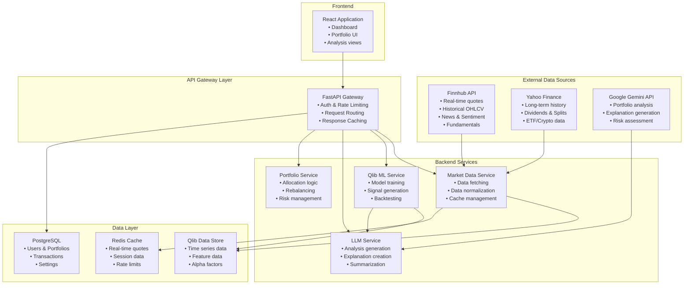
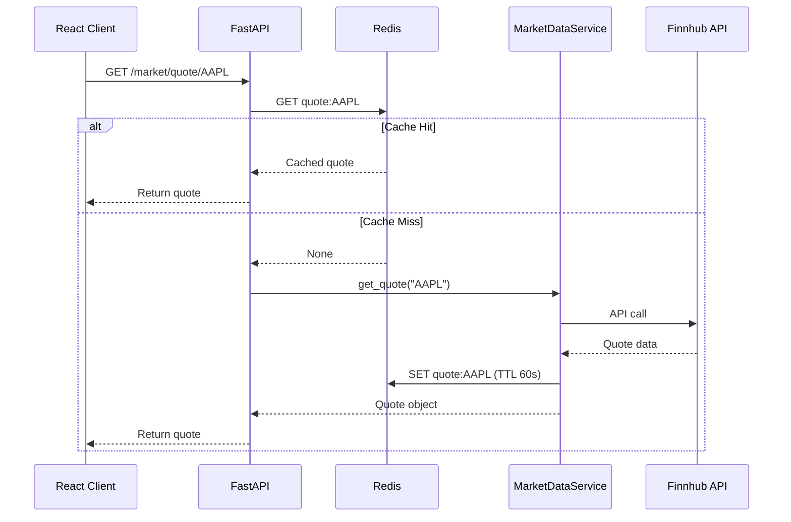
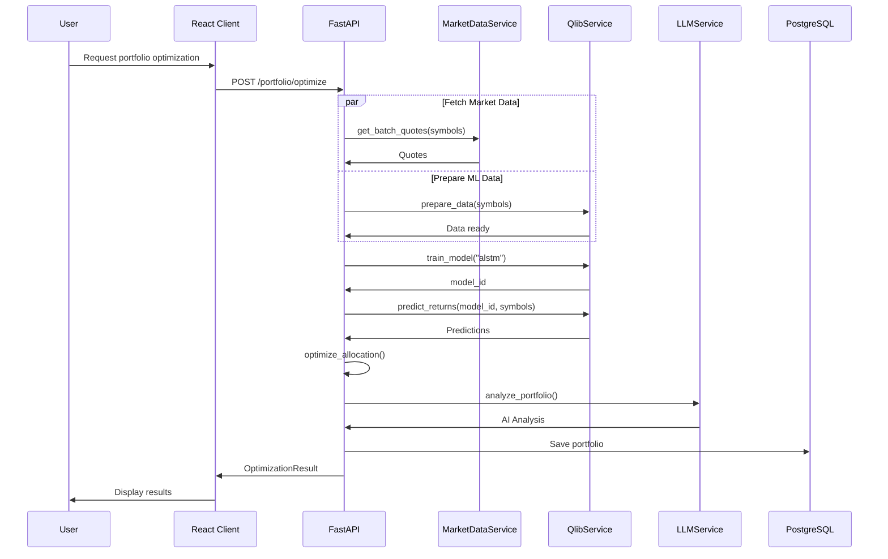

# Real-Data Architecture Design

## System Overview

This document describes the comprehensive data architecture for AutoInvest, integrating real market data (Finnhub), ML/DL capabilities (Microsoft Qlib), and AI explanations (Gemini 2.0 Flash).



---

## Component Details

### 1. Market Data Service

**Purpose**: Fetch, normalize, and cache market data from external sources.

**File**: `backend/app/services/market_data.py`

```python
class MarketDataService:
    """
    Unified market data service that aggregates data from
    Finnhub (primary) and Yahoo Finance (backup).
    """
    
    def __init__(self):
        self.finnhub = FinnhubClient(settings.finnhub_api_key)
        self.yahoo = YahooFinanceClient()
        self.cache = RedisCache()
    
    async def get_quote(self, symbol: str) -> Quote:
        """
        Get real-time quote with caching.
        Cache TTL: 60 seconds for real-time data
        """
        cache_key = f"quote:{symbol}"
        cached = await self.cache.get(cache_key)
        if cached:
            return Quote.parse_raw(cached)
        
        # Fetch from Finnhub
        data = await self.finnhub.get_quote(symbol)
        quote = Quote(
            symbol=symbol,
            price=data['c'],
            change=data['d'],
            change_percent=data['dp'],
            high=data['h'],
            low=data['l'],
            open=data['o'],
            previous_close=data['pc'],
            timestamp=data['t']
        )
        
        # Cache for 60 seconds
        await self.cache.set(cache_key, quote.json(), ttl=60)
        return quote
    
    async def get_historical_data(
        self, 
        symbol: str, 
        period: str = "1y",
        interval: str = "1d"
    ) -> pd.DataFrame:
        """
        Get historical OHLCV data.
        Cache TTL: 1 hour for historical data
        """
        cache_key = f"historical:{symbol}:{period}:{interval}"
        cached = await self.cache.get(cache_key)
        if cached:
            return pd.read_json(cached)
        
        # Fetch from Yahoo Finance (more reliable for historical)
        data = self.yahoo.get_history(symbol, period, interval)
        
        # Cache for 1 hour
        await self.cache.set(cache_key, data.to_json(), ttl=3600)
        return data
    
    async def get_batch_quotes(self, symbols: List[str]) -> List[Quote]:
        """
        Get quotes for multiple symbols efficiently.
        Uses batching to respect rate limits.
        """
        quotes = []
        for symbol in symbols:
            quote = await self.get_quote(symbol)
            quotes.append(quote)
        return quotes
```

---

### 2. Qlib Integration Service

**Purpose**: Manage ML/DL models for portfolio optimization using Microsoft Qlib.

**File**: `backend/app/services/qlib_service.py`

```python
class QlibService:
    """
    Microsoft Qlib integration for quantitative finance.
    Handles data preparation, model training, and prediction.
    """
    
    def __init__(self):
        self.data_path = settings.qlib_data_path
        self.model_path = settings.model_cache_path
        self._initialize_qlib()
    
    def _initialize_qlib(self):
        """Initialize Qlib with US market data."""
        import qlib
        qlib.init(provider_uri=self.data_path, region=REG_US)
    
    async def prepare_data(
        self,
        symbols: List[str],
        start_date: str,
        end_date: str
    ):
        """
        Prepare Qlib-compatible data for given symbols.
        Downloads from Yahoo Finance and converts to Qlib format.
        """
        from qlib.data import D
        
        # Download data for symbols
        for symbol in symbols:
            data = await self.market_data.get_historical_data(
                symbol, 
                start_date=start_date,
                end_date=end_date
            )
            # Convert to Qlib format and save
            self._convert_to_qlib_format(symbol, data)
    
    def train_model(
        self,
        model_type: str = "alstm",
        start_date: str = None,
        end_date: str = None
    ) -> str:
        """
        Train a model for return prediction.
        
        Supported models:
        - alstm: Attention-based LSTM
        - tft: Temporal Fusion Transformer
        - gats: Graph Attention Network
        - lightgbm: LightGBM regressor
        """
        from qlib.contrib.model.pytorch_alstm import ALSTM
        from qlib.contrib.data.handler import Alpha158
        from qlib.workflow import R
        
        # Setup data handler with alpha factors
        handler = Alpha158(
            start_time=start_date,
            end_time=end_date,
            fit_start_time=start_date,
            fit_end_time=end_date,
            instruments="sp500",
        )
        
        # Initialize model based on type
        if model_type == "alstm":
            model = ALSTM(
                d_feat=handler.get_feature_dim(),
                hidden_size=64,
                num_layers=2,
                dropout=0.1,
                n_epochs=100,
                lr=0.001,
                batch_size=800,
                early_stop=10,
            )
        
        # Train model
        with R.start(experiment_name="portfolio_optimization"):
            model.fit(handler)
            model_id = R.get_recorder().id
            
        return model_id
    
    def predict_returns(
        self,
        model_id: str,
        symbols: List[str],
        date: str
    ) -> Dict[str, float]:
        """
        Predict returns for given symbols using trained model.
        """
        from qlib.workflow import R
        
        # Load model
        recorder = R.get_recorder(experiment_name="portfolio_optimization", recorder_id=model_id)
        model = recorder.load_object("trained_model")
        
        # Get predictions
        predictions = model.predict(symbols, date)
        
        return {symbol: float(pred) for symbol, pred in predictions.items()}
    
    def backtest_strategy(
        self,
        model_id: str,
        start_date: str,
        end_date: str,
        top_k: int = 10
    ) -> Dict:
        """
        Backtest the prediction strategy.
        """
        from qlib.contrib.strategy import TopkDropoutStrategy
        from qlib.contrib.backtest import backtest
        
        strategy = TopkDropoutStrategy(
            signal=model_id,
            topk=top_k,
            n_drop=2,
        )
        
        results = backtest(
            strategy=strategy,
            start_time=start_date,
            end_time=end_date,
        )
        
        return {
            "annual_return": results["annual_return"],
            "sharpe_ratio": results["sharpe_ratio"],
            "max_drawdown": results["max_drawdown"],
            "volatility": results["volatility"],
        }
```

---

### 3. LLM Service

**Purpose**: Generate AI explanations and analysis using Gemini 2.0 Flash.

**File**: `backend/app/services/llm_service.py`

```python
class LLMService:
    """
    Google Gemini 2.0 Flash integration for AI-powered
    portfolio analysis and explanation generation.
    """
    
    def __init__(self):
        import google.generativeai as genai
        genai.configure(api_key=settings.gemini_api_key)
        self.model = genai.GenerativeModel('gemini-2.0-flash-exp')
    
    async def analyze_portfolio(
        self,
        portfolio: Portfolio,
        market_data: Dict,
        predictions: Dict[str, float]
    ) -> PortfolioAnalysis:
        """
        Generate comprehensive portfolio analysis.
        """
        prompt = f"""
        Analyze this investment portfolio and provide structured recommendations.
        
        Portfolio Holdings:
        {json.dumps([h.dict() for h in portfolio.holdings], indent=2)}
        
        Market Context:
        {json.dumps(market_data, indent=2)}
        
        AI Predictions (expected returns):
        {json.dumps(predictions, indent=2)}
        
        Risk Tolerance: {portfolio.user.risk_tolerance}
        Investment Horizon: {portfolio.user.investment_horizon} years
        
        Provide analysis in this exact JSON format:
        {{
            "risk_assessment": {{
                "level": "low|moderate|high",
                "score": 0-100,
                "factors": ["factor1", "factor2"]
            }},
            "diversification_score": 0-100,
            "sector_allocation": {{
                "technology": 0-100,
                "healthcare": 0-100,
                ...
            }},
            "recommendations": [
                {{
                    "action": "buy|hold|sell|reduce",
                    "symbol": "TICKER",
                    "confidence": 0-100,
                    "rationale": "explanation"
                }}
            ],
            "overall_rating": "A|B|C|D|F",
            "summary": "2-3 sentence summary"
        }}
        """
        
        response = await self.model.generate_content_async(
            prompt,
            generation_config=genai.GenerationConfig(
                response_mime_type="application/json",
                temperature=0.3,
            )
        )
        
        analysis_data = json.loads(response.text)
        return PortfolioAnalysis(**analysis_data)
    
    async def explain_prediction(
        self,
        symbol: str,
        prediction_data: Dict,
        user_level: str = "beginner"
    ) -> str:
        """
        Explain a stock prediction in user-friendly terms.
        """
        level_guidance = {
            "beginner": "Use simple language. Avoid jargon. Explain any financial terms.",
            "intermediate": "Some financial knowledge assumed. Brief explanations of complex terms.",
            "advanced": "Professional terminology acceptable."
        }
        
        prompt = f"""
        Explain this stock prediction for {symbol}:
        
        Prediction Data:
        {json.dumps(prediction_data, indent=2)}
        
        Audience: {user_level} investor
        {level_guidance.get(user_level, level_guidance["beginner"])}
        
        Provide a 2-3 sentence explanation of why this prediction was made.
        Focus on the key factors driving the prediction.
        """
        
        response = await self.model.generate_content_async(prompt)
        return response.text
    
    async def generate_market_summary(
        self,
        market_data: Dict,
        news_sentiment: Dict
    ) -> str:
        """
        Generate a market summary combining price action and sentiment.
        """
        prompt = f"""
        Generate a market summary based on the following data:
        
        Market Data:
        {json.dumps(market_data, indent=2)}
        
        News Sentiment:
        {json.dumps(news_sentiment, indent=2)}
        
        Provide a concise 3-4 sentence summary highlighting:
        1. Key market movements
        2. Sentiment trends
        3. Notable events or concerns
        """
        
        response = await self.model.generate_content_async(prompt)
        return response.text
```

---

### 4. Portfolio Optimization Pipeline

**Purpose**: End-to-end pipeline from data fetching to optimized portfolio.

**File**: `backend/app/services/portfolio_pipeline.py`

```python
class PortfolioOptimizationPipeline:
    """
    Complete pipeline for portfolio optimization:
    1. Fetch market data
    2. Prepare Qlib data
    3. Generate predictions
    4. Optimize allocation
    5. Generate AI explanations
    """
    
    def __init__(self):
        self.market_data = MarketDataService()
        self.qlib = QlibService()
        self.llm = LLMService()
        self.portfolio_engine = PortfolioEngine()
    
    async def optimize(
        self,
        user: User,
        symbols: List[str],
        investment_amount: float,
        constraints: Dict = None
    ) -> OptimizationResult:
        """
        Run complete optimization pipeline.
        """
        # Step 1: Fetch real-time market data
        quotes = await self.market_data.get_batch_quotes(symbols)
        
        # Step 2: Get historical data for ML
        historical_data = {}
        for symbol in symbols:
            historical_data[symbol] = await self.market_data.get_historical_data(
                symbol, period="2y"
            )
        
        # Step 3: Prepare Qlib data
        await self.qlib.prepare_data(symbols, start_date="2022-01-01", end_date="2024-01-01")
        
        # Step 4: Train or load model
        model_id = self.qlib.train_model(
            model_type="alstm",
            start_date="2022-01-01",
            end_date="2023-06-01"
        )
        
        # Step 5: Generate predictions
        predictions = self.qlib.predict_returns(model_id, symbols, date="2024-01-01")
        
        # Step 6: Optimize portfolio allocation
        allocation = self.portfolio_engine.optimize(
            symbols=symbols,
            predictions=predictions,
            current_prices={q.symbol: q.price for q in quotes},
            investment_amount=investment_amount,
            risk_tolerance=user.risk_tolerance,
            constraints=constraints
        )
        
        # Step 7: Get market context
        market_context = {
            "sp500_change": await self._get_index_change("SPY"),
            "vix": await self._get_vix(),
            "sector_performance": await self._get_sector_performance()
        }
        
        # Step 8: Generate AI analysis
        portfolio = Portfolio(
            holdings=[PortfolioHolding(
                symbol=symbol,
                weight=allocation[symbol],
                predicted_return=predictions[symbol]
            ) for symbol in symbols],
            user=user
        )
        
        analysis = await self.llm.analyze_portfolio(
            portfolio=portfolio,
            market_data=market_context,
            predictions=predictions
        )
        
        return OptimizationResult(
            allocation=allocation,
            predictions=predictions,
            analysis=analysis,
            expected_return=self._calculate_expected_return(allocation, predictions),
            risk_metrics=self._calculate_risk_metrics(allocation, historical_data)
        )
```

---

## Data Flow Diagrams

### Real-Time Quote Flow



### Portfolio Optimization Flow



---

## Database Schema Updates

### New Tables

```sql
-- Market data cache
CREATE TABLE market_data_cache (
    id SERIAL PRIMARY KEY,
    symbol VARCHAR(20) NOT NULL,
    data_type VARCHAR(50) NOT NULL, -- quote, historical, fundamentals
    data JSONB NOT NULL,
    created_at TIMESTAMP DEFAULT CURRENT_TIMESTAMP,
    expires_at TIMESTAMP NOT NULL,
    UNIQUE(symbol, data_type)
);

CREATE INDEX idx_market_data_symbol ON market_data_cache(symbol);
CREATE INDEX idx_market_data_expires ON market_data_cache(expires_at);

-- ML Models
CREATE TABLE ml_models (
    id SERIAL PRIMARY KEY,
    model_type VARCHAR(50) NOT NULL,
    model_id VARCHAR(100) NOT NULL UNIQUE, -- Qlib recorder ID
    status VARCHAR(20) NOT NULL, -- training, active, archived
    metrics JSONB,
    trained_at TIMESTAMP,
    created_at TIMESTAMP DEFAULT CURRENT_TIMESTAMP
);

-- Predictions
CREATE TABLE predictions (
    id SERIAL PRIMARY KEY,
    model_id INTEGER REFERENCES ml_models(id),
    symbol VARCHAR(20) NOT NULL,
    predicted_return FLOAT NOT NULL,
    confidence FLOAT,
    prediction_date DATE NOT NULL,
    created_at TIMESTAMP DEFAULT CURRENT_TIMESTAMP
);

CREATE INDEX idx_predictions_symbol ON predictions(symbol, prediction_date);
CREATE INDEX idx_predictions_model ON predictions(model_id);

-- AI Analysis Cache
CREATE TABLE ai_analysis_cache (
    id SERIAL PRIMARY KEY,
    portfolio_id INTEGER REFERENCES portfolios(id),
    analysis_type VARCHAR(50) NOT NULL,
    analysis_data JSONB NOT NULL,
    created_at TIMESTAMP DEFAULT CURRENT_TIMESTAMP,
    expires_at TIMESTAMP NOT NULL
);
```

---

## Configuration

### Environment Variables

```bash
# Market Data APIs
FINNHUB_API_KEY=your_finnhub_api_key

# LLM APIs
GEMINI_API_KEY=your_gemini_api_key

# Qlib Configuration
QLIB_DATA_PATH=./data/qlib_data
QLIB_REGION=us

# Cache Configuration
REDIS_URL=redis://localhost:6379/0
CACHE_TTL_QUOTE=60
CACHE_TTL_HISTORICAL=3600
CACHE_TTL_ANALYSIS=1800

# Model Configuration
MODEL_CACHE_PATH=./models/cache
DEFAULT_MODEL_TYPE=alstm
MODEL_RETRAIN_INTERVAL_DAYS=30
```

---

## Rate Limiting & Caching Strategy

### API Rate Limits

| Service | Free Tier | Strategy |
|---------|-----------|----------|
| Finnhub | 60/min | Cache 60s, batch requests |
| Gemini | 15/min | Cache analysis 30min |
| Yahoo Finance | Unofficial | Use as backup only |

### Cache Hierarchy

1. **Redis (Hot Cache)**
   - Real-time quotes: 60s TTL
   - Historical data: 1 hour TTL
   - AI analysis: 30 min TTL

2. **PostgreSQL (Warm Cache)**
   - Cached predictions
   - AI analysis results
   - User-specific data

3. **Qlib Data Store (Cold Storage)**
   - Historical OHLCV
   - Computed features
   - Model checkpoints

---

## Implementation Checklist

### Phase 1: Market Data
- [ ] Create MarketDataService with Finnhub integration
- [ ] Implement Redis caching layer
- [ ] Add rate limiting
- [ ] Create API endpoints for quotes and historical data
- [ ] Build React components for real-time data display

### Phase 2: Qlib Integration
- [ ] Install and configure Qlib
- [ ] Create data preparation pipeline
- [ ] Implement model training service
- [ ] Add prediction endpoints
- [ ] Create backtesting functionality

### Phase 3: LLM Integration
- [ ] Set up Gemini 2.0 Flash client
- [ ] Implement portfolio analysis generation
- [ ] Create prediction explanation service
- [ ] Add market summary generation
- [ ] Build React components for AI insights

### Phase 4: Integration
- [ ] Connect all services in pipeline
- [ ] Add error handling and fallbacks
- [ ] Implement caching at all layers
- [ ] Add monitoring and logging
- [ ] Performance optimization
