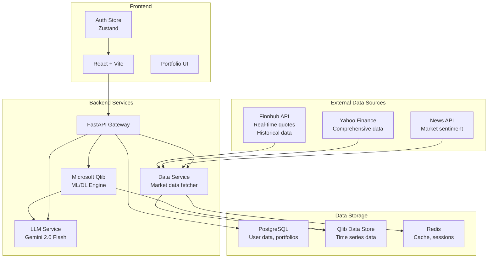

# AutoInvest Implementation Plan

## Overview
This document outlines the complete implementation plan for the AutoInvest platform, covering authentication fixes, real data integration, virtual money system, and ML model implementation.

---

## Phase 1: Authentication & Login Flow Fixes

### 1.1 Login Component Fixes
**File**: [`frontend/web/src/pages/Login.jsx`](frontend/web/src/pages/Login.jsx:1)

**Issues to fix**:
- Password field not clearing after successful login
- Need to ensure proper form reset after submission

**Changes needed**:
```javascript
// After successful login, clear form data
setFormData({ email: '', password: '' })
```

### 1.2 Protected Route Component
**New File**: `frontend/web/src/components/ProtectedRoute.jsx`

Create a wrapper component that:
- Checks [`useAuthStore`](frontend/web/src/store/authStore.js:1) for `isAuthenticated`
- Redirects to `/login` if not authenticated
- Preserves the intended destination for post-login redirect

### 1.3 Route Protection in App.jsx
**File**: [`frontend/web/src/App.jsx`](frontend/web/src/App.jsx:1)

Wrap protected routes:
- `/dashboard` - Protected
- `/portfolio/:id?` - Protected  
- `/analysis` - Protected

---

## Phase 2: Real Data Architecture Design

### 2.1 Market Data API Research

#### Option 1: Finnhub (Recommended)
- **URL**: https://finnhub.io
- **Free Tier**: 60 API calls/minute
- **Features**:
  - Real-time stock quotes (US markets)
  - Historical data
  - Company fundamentals
  - News sentiment
  - Economic calendar
- **API Key**: Required (free registration)

**Key Endpoints**:
```
GET /api/v1/quote?symbol=AAPL&token={API_KEY}
GET /api/v1/stock/candle?symbol=AAPL&resolution=D&from={timestamp}&to={timestamp}&token={API_KEY}
GET /api/v1/stock/metric?symbol=AAPL&metric=all&token={API_KEY}
GET /api/v1/news?category=general&token={API_KEY}
```

#### Option 2: Alpha Vantage (Backup)
- **URL**: https://www.alphavantage.co
- **Free Tier**: 25 API calls/day
- **Features**: Stock quotes, technical indicators, fundamental data

#### Option 3: Yahoo Finance (Unofficial)
- **Library**: `yfinance` (Python)
- **Pros**: Free, comprehensive data
- **Cons**: Unofficial API, may break

### 2.2 LLM API Research

#### Option 1: Google Gemini 2.0 Flash (Recommended)
- **URL**: https://ai.google.dev
- **Free Tier**: 1,500 requests/day (Gemini 2.0 Flash)
- **Features**:
  - Fast responses
  - Good for financial analysis
  - JSON mode support
- **API Key**: Google AI Studio

**Pricing**:
- Gemini 2.0 Flash: Free tier available
- Rate limits: 15 RPM (requests per minute) on free tier

#### Option 2: OpenRouter
- **URL**: https://openrouter.ai
- **Free Models Available**: Various open-source models
- **Features**: Unified API for multiple LLMs

#### Option 3: Groq
- **URL**: https://groq.com
- **Free Tier**: Available with rate limits
- **Fast inference** for open-source models

### 2.3 Architecture Diagram



---

## Phase 3: Virtual Money System

### 3.1 Database Schema Updates

**File**: [`backend/app/models/user.py`](backend/app/models/user.py:1)

Add fields:
```python
# Virtual money fields
virtual_balance: Mapped[float] = mapped_column(Float, default=10000.0)  # Starting balance
virtual_balance_currency: Mapped[str] = mapped_column(String(3), default="USD")
total_deposited: Mapped[float] = mapped_column(Float, default=0.0)
total_withdrawn: Mapped[float] = mapped_column(Float, default=0.0)
```

**New Model**: `Transaction`
```python
class Transaction(Base):
    __tablename__ = "transactions"
    
    id: Mapped[int] = mapped_column(Integer, primary_key=True)
    user_id: Mapped[int] = mapped_column(ForeignKey("users.id"))
    type: Mapped[str] = mapped_column(String(20))  # deposit, withdrawal
    amount: Mapped[float] = mapped_column(Float)
    status: Mapped[str] = mapped_column(String(20))  # pending, completed, failed
    description: Mapped[Optional[str]] = mapped_column(Text)
    created_at: Mapped[datetime] = mapped_column(DateTime, default=datetime.utcnow)
```

### 3.2 API Endpoints

**File**: [`backend/app/api/v1/endpoints/users.py`](backend/app/api/v1/endpoints/users.py:1)

New endpoints:
```python
@router.post("/me/deposit")
async def deposit_funds(amount: float, current_user: User = Depends(get_current_user))

@router.post("/me/withdraw")
async def withdraw_funds(amount: float, current_user: User = Depends(get_current_user))

@router.get("/me/balance")
async def get_balance(current_user: User = Depends(get_current_user))

@router.get("/me/transactions")
async def get_transactions(current_user: User = Depends(get_current_user))
```

### 3.3 Frontend Components

**New File**: `frontend/web/src/components/WalletCard.jsx`
- Display current balance
- Quick deposit/withdraw buttons

**New File**: `frontend/web/src/components/DepositModal.jsx`
- Amount input
- Confirmation flow

**New File**: `frontend/web/src/components/WithdrawModal.jsx`
- Amount input with balance validation
- Confirmation flow

---

## Phase 4: Microsoft Qlib Integration

### 4.1 Installation

**File**: [`backend/requirements.txt`](backend/requirements.txt:1)

Add dependencies:
```
# Microsoft Qlib
pyqlib

# ML/DL dependencies
torch
tensorflow
lightgbm
xgboost
```

### 4.2 Qlib Data Setup

**New File**: `backend/app/services/data_qlib.py`

```python
import qlib
from qlib.data import D
from qlib.config import REG_CN, REG_US

class QlibDataManager:
    def __init__(self, region=REG_US):
        self.region = region
        qlib.init(provider_uri='~/.qlib/qlib_data/us_1d')
    
    def fetch_stock_data(self, symbols, start_date, end_date):
        """Fetch historical stock data from Qlib."""
        fields = ['$open', '$high', '$low', '$close', '$volume']
        data = D.features(symbols, fields, start_date, end_date)
        return data
```

### 4.3 ML Model Implementation

**New File**: `backend/app/engines/quant_engine/qlib_models.py`

Implement portfolio optimization model:
```python
from qlib.model.trainer import Trainer
from qlib.workflow import R
from qlib.contrib.model.pytorch_alstm import ALSTM
from qlib.contrib.data.handler import Alpha158

class PortfolioOptimizer:
    def __init__(self):
        self.model = None
        self.handler = None
    
    def train_model(self, start_date, end_date):
        """Train LSTM model for return prediction."""
        # Setup data handler
        self.handler = Alpha158(
            start_time=start_date,
            end_time=end_date,
            fit_start_time=start_date,
            fit_end_time=end_date,
            instruments='sp500',
        )
        
        # Train model
        self.model = ALSTM(
            d_feat=self.handler.get_feature_dim(),
            hidden_size=64,
            num_layers=2,
            dropout=0.1,
        )
        
        trainer = Trainer()
        trainer.fit(self.model, self.handler)
    
    def predict_returns(self, symbols):
        """Predict returns for given symbols."""
        if not self.model:
            raise ValueError("Model not trained")
        return self.model.predict(symbols)
```

### 4.4 API Integration

**File**: [`backend/app/api/v1/endpoints/analysis.py`](backend/app/api/v1/endpoints/analysis.py:1)

New endpoints:
```python
@router.post("/portfolio-optimize")
async def optimize_portfolio(
    symbols: List[str],
    risk_tolerance: str,
    current_user: User = Depends(get_current_user)
)

@router.get("/model-status")
async def get_model_status()

@router.post("/train-model")
async def train_ml_model(
    start_date: str,
    end_date: str,
    current_user: User = Depends(get_current_user)
)
```

---

## Phase 5: Implementation Order

### Week 1: Authentication & Foundation
1. Fix Login component - clear password field
2. Create ProtectedRoute component
3. Update App.jsx with route protection
4. Test complete login flow

### Week 2: Virtual Money System
1. Update User model with balance fields
2. Create Transaction model
3. Implement deposit/withdrawal endpoints
4. Build Wallet UI components
5. Test money system

### Week 3: Market Data Integration
1. Set up Finnhub API integration
2. Create data fetching service
3. Implement caching with Redis
4. Add real-time quote endpoints
5. Test data flow

### Week 4: Qlib & ML Models
1. Install and configure Qlib
2. Set up data pipeline
3. Implement first ML model (LSTM)
4. Create portfolio optimization endpoint
5. Integrate with frontend

### Week 5: LLM Integration & Polish
1. Integrate Gemini 2.0 Flash
2. Add AI explanations for recommendations
3. End-to-end testing
4. Performance optimization
5. Documentation

---

## API Keys Required

1. **Finnhub**: https://finnhub.io/register
2. **Google AI Studio (Gemini)**: https://makersuite.google.com/app/apikey
3. **News API** (optional): https://newsapi.org/register

---

## Environment Variables

Add to [`backend/.env`](backend/.env:1):
```bash
# Market Data APIs
FINNHUB_API_KEY=your_finnhub_key
NEWS_API_KEY=your_news_api_key

# LLM APIs
GEMINI_API_KEY=your_gemini_key

# Qlib Configuration
QLIB_DATA_PATH=./data/qlib_data
MODEL_CACHE_PATH=./models/cache
```

---

## Testing Checklist

### Authentication
- [ ] Login clears password field
- [ ] Protected routes redirect to login
- [ ] Authenticated users can access protected pages
- [ ] Logout clears auth state
- [ ] Token refresh works correctly

### Virtual Money
- [ ] Users can deposit funds
- [ ] Users can withdraw funds
- [ ] Balance updates correctly
- [ ] Transaction history is recorded
- [ ] Insufficient funds error on withdrawal

### Market Data
- [ ] Real-time quotes fetch correctly
- [ ] Historical data loads
- [ ] Data is cached properly
- [ ] API rate limits handled

### ML Models
- [ ] Qlib initializes correctly
- [ ] Model training completes
- [ ] Predictions return valid data
- [ ] Portfolio optimization works
- [ ] AI explanations are generated
