# AutoInvest - Complete System Architecture

## Executive Summary

This document outlines the complete system architecture for AutoInvest, an AI-powered auto-investment platform. The system combines an AI Research Agent for asset analysis, a Quant Engine (Microsoft Qlib) for signal generation, and an automated Portfolio Manager for allocation and rebalancing.

---

## 1. High-Level Architecture

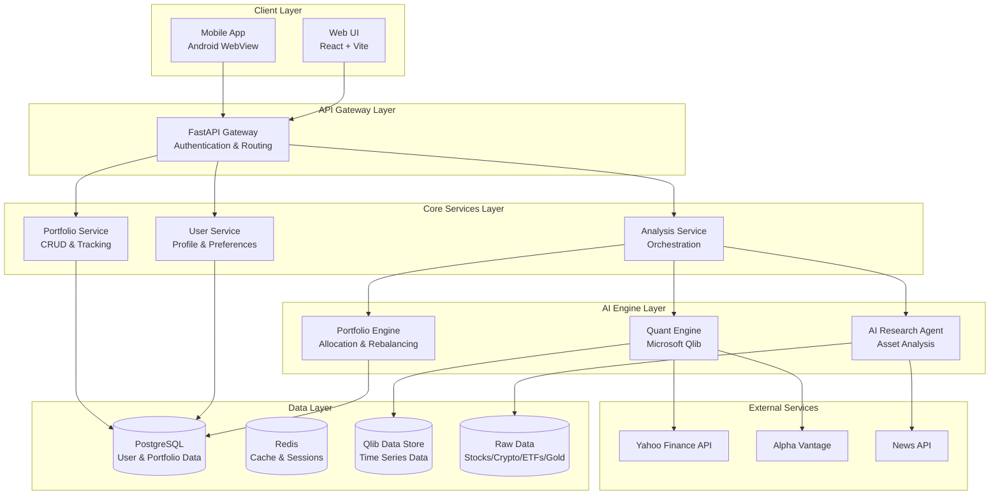

---

## 2. Component Responsibilities

### 2.1 Client Layer

| Component | Technology | Responsibility |
|-----------|------------|----------------|
| Web UI | React + Vite | User interface for portfolio management, analysis visualization, and preference configuration |
| Mobile App | Android WebView | Mobile access to platform features |

### 2.2 API Gateway Layer

| Component | Technology | Responsibility |
|-----------|------------|----------------|
| FastAPI Gateway | Python FastAPI | Request routing, authentication, rate limiting, request validation |

### 2.3 Core Services Layer

| Component | Responsibility |
|-----------|----------------|
| User Service | User registration, authentication, profile management, investment preferences |
| Portfolio Service | Portfolio CRUD operations, historical tracking, performance metrics |
| Analysis Service | Orchestrates AI Research Agent, Quant Engine, and Portfolio Engine workflows |

### 2.4 AI Engine Layer

| Component | Technology | Responsibility |
|-----------|------------|----------------|
| AI Research Agent | Python + LLM APIs | Fundamental analysis, news sentiment, asset screening, explainability generation |
| Quant Engine | Microsoft Qlib + PyTorch | Signal generation using Transformers/LSTMs/Temporal Fusion Transformers, Graph Neural Networks for asset relationships, alpha factor computation, return prediction, backtesting |
| Portfolio Engine | Python + PyPortfolioOpt | Asset allocation, risk management, rebalancing logic |

### 2.5 Data Layer

| Component | Technology | Responsibility |
|-----------|------------|----------------|
| PostgreSQL | SQL Database | User data, portfolio configurations, transaction history |
| Redis | In-Memory Store | Session management, caching, rate limiting |
| Qlib Data Store | Qlib Format | Processed time series data for ML models |
| Raw Data | CSV/Parquet | Raw market data for stocks, crypto, ETFs, gold |

---

## 3. Data Flow

### 3.1 Portfolio Creation Flow

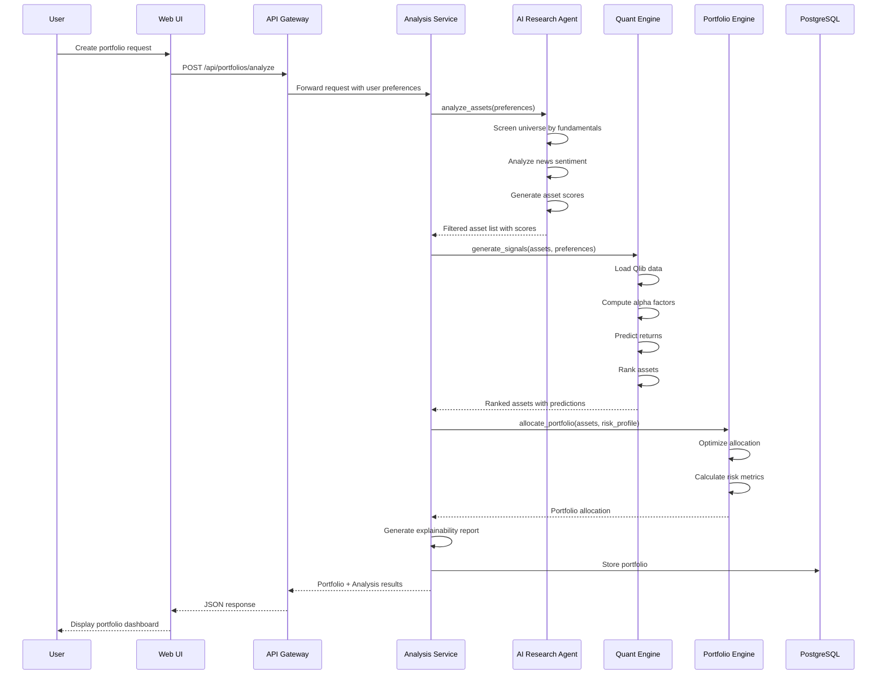

### 3.2 Rebalancing Flow

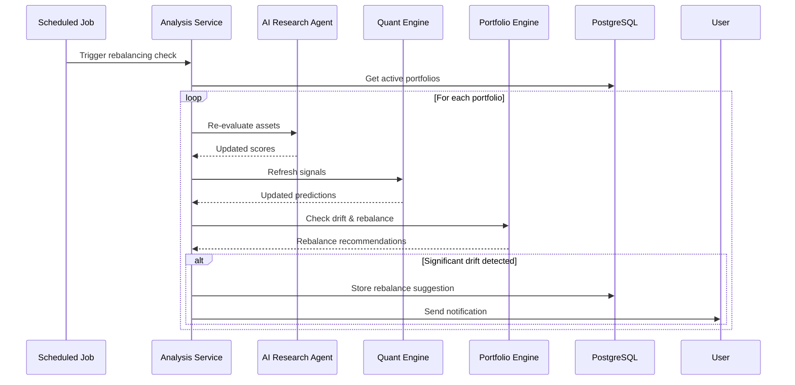

### 3.3 Data Ingestion Flow

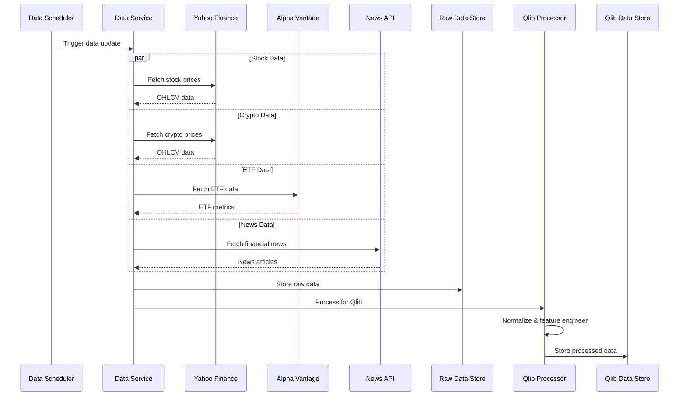

---

## 4. Folder Structure & Responsibilities

```
autoinvest/
├── backend/
│   ├── app/
│   │   ├── __init__.py
│   │   ├── main.py                 # FastAPI application entry point
│   │   ├── core/
│   │   │   ├── __init__.py
│   │   │   ├── config.py           # Configuration management
│   │   │   ├── security.py         # Authentication & authorization
│   │   │   └── logging.py          # Logging configuration
│   │   ├── api/
│   │   │   ├── __init__.py
│   │   │   ├── deps.py             # Dependency injection
│   │   │   ├── v1/
│   │   │   │   ├── __init__.py
│   │   │   │   ├── router.py       # API v1 router aggregation
│   │   │   │   ├── endpoints/
│   │   │   │   │   ├── users.py    # User management endpoints
│   │   │   │   │   ├── portfolios.py # Portfolio endpoints
│   │   │   │   │   ├── analysis.py   # Analysis endpoints
│   │   │   │   │   └── auth.py     # Authentication endpoints
│   │   │   │   └── schemas/
│   │   │   │       ├── user.py     # User Pydantic schemas
│   │   │   │       ├── portfolio.py # Portfolio schemas
│   │   │   │       └── analysis.py  # Analysis schemas
│   │   ├── services/
│   │   │   ├── __init__.py
│   │   │   ├── user_service.py     # User business logic
│   │   │   ├── portfolio_service.py # Portfolio business logic
│   │   │   └── analysis_service.py  # Analysis orchestration
│   │   ├── models/
│   │   │   ├── __init__.py
│   │   │   ├── user.py             # SQLAlchemy user models
│   │   │   ├── portfolio.py        # Portfolio models
│   │   │   └── base.py             # Base model definitions
│   │   ├── db/
│   │   │   ├── __init__.py
│   │   │   ├── session.py          # Database session management
│   │   │   └── migrations/         # Alembic migrations
│   │   ├── agents/
│   │   │   ├── __init__.py
│   │   │   ├── research_agent/
│   │   │   │   ├── __init__.py
│   │   │   │   ├── agent.py        # Research Agent implementation
│   │   │   │   ├── fundamental.py  # Fundamental analysis
│   │   │   │   ├── sentiment.py    # News sentiment analysis
│   │   │   │   └── explainability.py # Decision explanation
│   │   │   └── base_agent.py       # Base agent class
│   │   ├── engines/
│   │   │   ├── __init__.py
│   │   │   ├── quant_engine/
│   │   │   │   ├── __init__.py
│   │   │   │   ├── engine.py       # Qlib integration
│   │   │   │   ├── factors.py      # Alpha factor definitions
│   │   │   │   ├── models.py       # ML model configurations
│   │   │   │   ├── backtest.py     # Backtesting utilities
│   │   │   │   └── config/         # Qlib configuration files
│   │   │   └── portfolio_engine/
│   │   │       ├── __init__.py
│   │   │       ├── engine.py       # Portfolio optimization
│   │   │       ├── allocation.py   # Allocation algorithms
│   │   │       ├── risk.py         # Risk management
│   │   │       └── rebalance.py    # Rebalancing logic
│   │   ├── data/
│   │   │   ├── __init__.py
│   │   │   ├── ingest.py           # Data ingestion service
│   │   │   ├── processors.py       # Data processing
│   │   │   └── providers/          # External data providers
│   │   │       ├── yahoo.py
│   │   │       ├── alpha_vantage.py
│   │   │       └── news.py
│   │   └── utils/
│   │       ├── __init__.py
│   │       └── helpers.py
│   ├── tests/
│   ├── alembic.ini
│   ├── requirements.txt
│   └── Dockerfile
├── frontend/
│   └── web/
│       ├── src/
│       │   ├── components/         # Reusable UI components
│       │   ├── pages/              # Page components
│       │   │   ├── Dashboard.jsx
│       │   │   ├── Portfolio.jsx
│       │   │   ├── Analysis.jsx
│       │   │   └── Settings.jsx
│       │   ├── services/           # API client services
│       │   ├── store/              # State management
│       │   └── utils/              # Utility functions
│       └── package.json
├── data/
│   ├── raw/                        # Raw downloaded data
│   │   ├── stocks/
│   │   ├── crypto/
│   │   ├── etfs/
│   │   └── gold/
│   ├── processed/                  # Processed features
│   └── qlib_data/                  # Qlib-formatted data
├── scripts/
│   ├── data_ingestion.py           # Data ingestion scripts
│   ├── backtest.py                 # Backtesting scripts
│   └── setup_qlib.py               # Qlib initialization
└── docs/
    └── architecture/               # Architecture documentation
```

---

## 5. API Boundaries

### 5.1 Public API Endpoints (REST)

#### Authentication
```
POST   /api/v1/auth/register          # User registration
POST   /api/v1/auth/login             # User login
POST   /api/v1/auth/logout            # User logout
POST   /api/v1/auth/refresh           # Refresh access token
GET    /api/v1/auth/me                # Get current user
```

#### Users
```
GET    /api/v1/users/me               # Get user profile
PUT    /api/v1/users/me               # Update user profile
PUT    /api/v1/users/me/preferences   # Update investment preferences
```

#### Portfolios
```
GET    /api/v1/portfolios             # List user portfolios
POST   /api/v1/portfolios             # Create new portfolio
GET    /api/v1/portfolios/{id}        # Get portfolio details
PUT    /api/v1/portfolios/{id}        # Update portfolio
DELETE /api/v1/portfolios/{id}        # Delete portfolio
GET    /api/v1/portfolios/{id}/performance  # Get performance metrics
POST   /api/v1/portfolios/{id}/rebalance    # Trigger rebalancing
```

#### Analysis
```
POST   /api/v1/analysis/assets        # Analyze asset universe
POST   /api/v1/analysis/portfolio     # Generate portfolio recommendation
GET    /api/v1/analysis/signals/{asset}     # Get signals for asset
GET    /api/v1/analysis/explain/{portfolio_id}  # Get explainability report
POST   /api/v1/analysis/backtest      # Run backtest simulation
```

#### Market Data
```
GET    /api/v1/market/assets          # List available assets
GET    /api/v1/market/assets/{symbol} # Get asset details
GET    /api/v1/market/prices/{symbol} # Get historical prices
GET    /api/v1/market/news            # Get market news
```

### 5.2 Internal Service APIs

#### AI Research Agent Interface
```python
class ResearchAgentInterface:
    async def analyze_assets(
        self, 
        universe: List[str], 
        preferences: UserPreferences
    ) -> AssetAnalysisResult:
        """
        Analyze assets and return scores with explanations.
        
        Returns:
            - filtered_assets: List of assets passing screening
            - scores: Fundamental and sentiment scores
            - explanations: Natural language explanations
        """
        pass
    
    async def generate_explanation(
        self,
        portfolio: Portfolio,
        signals: Dict[str, Signal]
    ) -> ExplanationReport:
        """Generate human-readable explanation for portfolio decisions."""
        pass
```

#### Quant Engine Interface
```python
class QuantEngineInterface:
    async def generate_signals(
        self,
        assets: List[str],
        model_type: ModelType = ModelType.TEMPORAL_FUSION_TRANSFORMER,
        lookback_days: int = 252
    ) -> SignalResult:
        """
        Generate trading signals using state-of-the-art DL models.
        
        Supported Models:
            - Temporal Fusion Transformer (TFT) for multi-horizon forecasting
            - LSTM/GRU with Attention for sequential patterns
            - Transformer-based models for long-range dependencies
            - Graph Neural Networks (GNN) for asset relationship modeling
            - N-BEATS/N-HiTS for pure time series forecasting
        
        Returns:
            - predictions: Return predictions for each asset
            - confidence: Confidence scores with uncertainty quantification
            - attention_weights: Model interpretability scores
            - factors: Deep learned alpha factors
            - rankings: Asset rankings
        """
        pass
    
    async def train_model(
        self,
        model_config: DeepLearningConfig,
        dataset: QlibDataset,
        validation_split: float = 0.2
    ) -> TrainingResult:
        """
        Train custom deep learning models.
        
        Supports:
            - Transfer learning from pre-trained financial models
            - Hyperparameter optimization with Optuna
            - Ensemble methods combining multiple architectures
        """
        pass
    
    async def backtest_strategy(
        self,
        strategy_config: StrategyConfig,
        start_date: datetime,
        end_date: datetime,
        use_deep_learning: bool = True
    ) -> BacktestResult:
        """Run backtest simulation with DL-powered signals."""
        pass
    
    async def get_factor_exposure(
        self,
        portfolio: Portfolio
    ) -> FactorExposure:
        """Get factor exposure analysis including learned deep factors."""
        pass
    
    async def explain_prediction(
        self,
        asset: str,
        model_type: ModelType
    ) -> PredictionExplanation:
        """
        Explain model predictions using SHAP, attention visualization,
        and feature importance analysis.
        """
        pass
```

#### Portfolio Engine Interface
```python
class PortfolioEngineInterface:
    async def optimize_allocation(
        self,
        assets: List[str],
        predictions: Dict[str, float],
        risk_profile: RiskProfile,
        constraints: PortfolioConstraints
    ) -> AllocationResult:
        """
        Optimize portfolio allocation.
        
        Returns:
            - weights: Optimal asset weights
            - expected_return: Portfolio expected return
            - risk_metrics: VaR, CVaR, volatility, etc.
            - diversification_metrics: Concentration measures
        """
        pass
    
    async def check_rebalance_needed(
        self,
        portfolio: Portfolio,
        current_weights: Dict[str, float],
        threshold: float = 0.05
    ) -> RebalanceRecommendation:
        """Check if portfolio rebalancing is needed."""
        pass
    
    async def generate_rebalance_plan(
        self,
        portfolio: Portfolio,
        target_weights: Dict[str, float]
    ) -> RebalancePlan:
        """Generate rebalancing execution plan."""
        pass
```

---

## 6. AI Agent Interactions

### 6.1 Agent Architecture

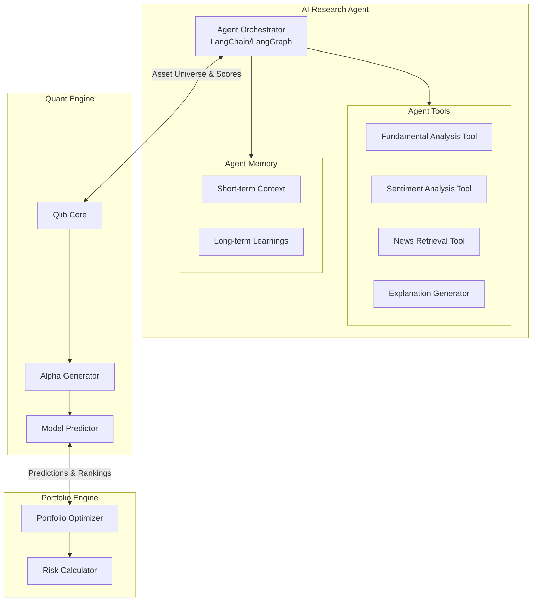

### 6.2 Agent Communication Patterns

#### Pattern 1: Request-Response (Synchronous)
Used for real-time portfolio generation:
- Web UI → Analysis Service → Research Agent → Quant Engine → Portfolio Engine → Response

#### Pattern 2: Event-Driven (Asynchronous)
Used for background tasks:
- Data updates trigger signal recalculation
- Rebalancing checks on schedule
- News sentiment updates

#### Pattern 3: Workflow Orchestration
Used for complex multi-step analysis:
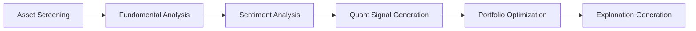

### 6.3 Agent Responsibilities

| Agent | Input | Output | Key Capabilities |
|-------|-------|--------|------------------|
| **Research Agent** | Asset universe, user preferences, market data | Filtered assets, fundamental scores, sentiment scores, explanations | LLM-based reasoning, news analysis, fundamental screening |
| **Quant Engine** | Historical prices, asset list, model config | Return predictions, alpha factors, rankings, backtest results | **Temporal Fusion Transformers, LSTM-Attention, Graph Neural Networks, Transformers, N-BEATS, Deep Reinforcement Learning** |
| **Portfolio Engine** | Predictions, risk profile, constraints | Optimal weights, risk metrics, rebalance plans | Optimization algorithms, risk management |

---

## 7. Service Exposures

### 7.1 What Each Service Exposes

| Service | Exposes To | Interface Type | Key Operations |
|---------|------------|----------------|----------------|
| **API Gateway** | Client applications | REST/HTTP | Route, authenticate, validate, rate limit |
| **User Service** | API Gateway | Internal API | CRUD users, manage preferences |
| **Portfolio Service** | API Gateway, Analysis Service | Internal API | CRUD portfolios, track performance |
| **Analysis Service** | API Gateway | Internal API | Orchestrate analysis workflow |
| **Research Agent** | Analysis Service | Python Interface | analyze_assets(), generate_explanation() |
| **Quant Engine** | Analysis Service | Python Interface | generate_signals(), backtest_strategy() |
| **Portfolio Engine** | Analysis Service | Python Interface | optimize_allocation(), check_rebalance_needed() |
| **Data Service** | All services | Internal API | ingest_data(), get_market_data() |

### 7.2 Service Dependencies

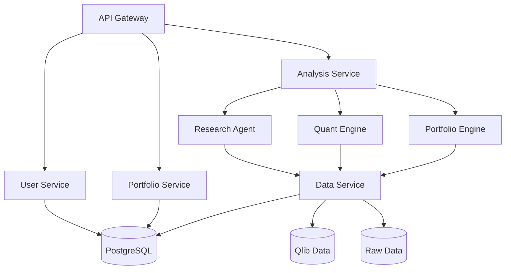

---

## 8. Technology Stack Summary

| Layer | Technology |
|-------|------------|
| Frontend | React, Vite, Three.js, Framer Motion, Tailwind CSS, Recharts/D3.js |
| API Gateway | FastAPI, Uvicorn |
| Services | Python, FastAPI, SQLAlchemy |
| AI/ML | Microsoft Qlib, PyPortfolioOpt, LangChain, PyTorch, Transformers |
| Database | PostgreSQL, Redis |
| Data Processing | Pandas, NumPy, Qlib |
| External APIs | Yahoo Finance, Alpha Vantage, NewsAPI |
| Deployment | Docker, Docker Compose |

---

## 9. Key Design Decisions

1. **Modular Architecture**: Each engine (Research, Quant, Portfolio) is independent and can be developed/tested separately
2. **Qlib Integration**: Leverages Microsoft's Qlib for quantitative analysis, providing robust backtesting and alpha research capabilities
3. **Async Processing**: Analysis workflows use async patterns for better performance
4. **Explainability First**: AI decisions are always explainable through the Research Agent
5. **No Live Trading**: System is decision-support only, no brokerage integration
6. **Event-Driven Updates**: Data ingestion and rebalancing are event-driven rather than real-time

---

## 10. Deep Learning Model Architecture

### 10.1 Model Zoo

The Quant Engine will implement a comprehensive model zoo with the latest architectures:

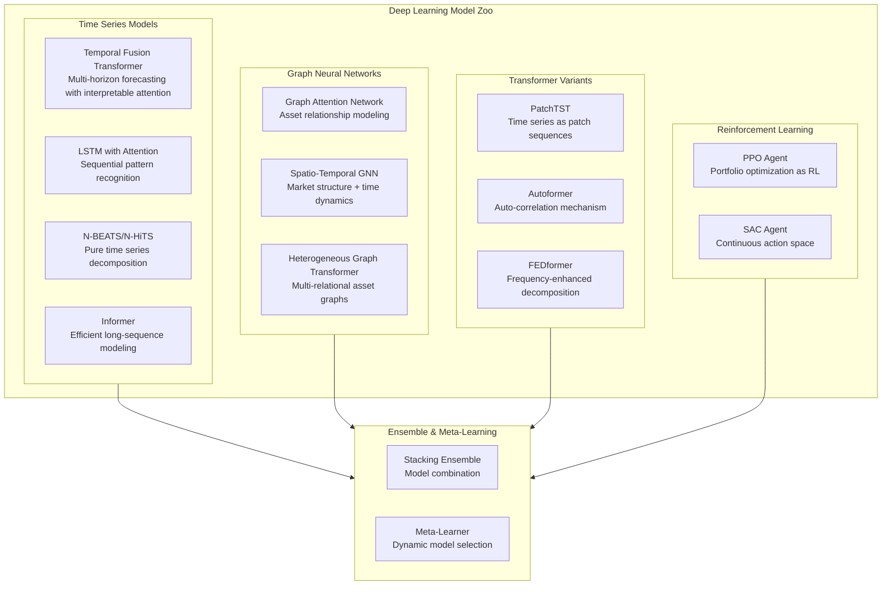

### 10.2 Model Capabilities

| Model Type | Architecture | Use Case | Key Advantage |
|------------|--------------|----------|---------------|
| **Temporal Fusion Transformer** | Attention-based | Multi-horizon return prediction | Interpretable attention, static covariates |
| **LSTM + Attention** | RNN-based | Short-term trend detection | Captures sequential dependencies |
| **N-BEATS/N-HiTS** | MLP-based | Trend/seasonality decomposition | Interpretable outputs, fast training |
| **PatchTST** | Transformer | Long sequence modeling | Efficient, SOTA on many benchmarks |
| **Graph Attention Network** | GNN | Cross-asset influence modeling | Captures market structure |
| **Spatio-Temporal GNN** | GNN+RNN | Market dynamics + relationships | Joint spatial-temporal learning |
| **PPO/SAC Agents** | RL | Dynamic portfolio rebalancing | Adaptive to market regimes |
| **Informer/Autoformer** | Transformer | Long-term forecasting | O(L) complexity vs O(L²) |

### 10.3 Training Pipeline

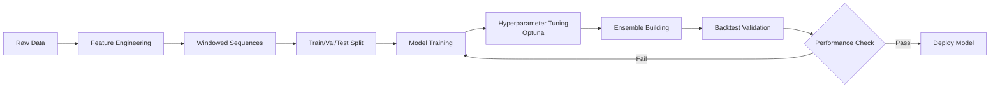

### 10.4 Model Explainability

All models support explainability through:
- **SHAP Values**: Feature importance for any prediction
- **Attention Visualization**: See what the model focuses on
- **Gradient-based Methods**: Integrated gradients for deep networks
- **Counterfactual Explanations**: What would change the prediction?

## 11. Mesmerizing UI/UX Architecture

### 11.1 Design Philosophy

The UI will be **futuristic, immersive, and visually stunning** - inspired by:
- **Sci-fi movie interfaces** (Iron Man JARVIS, Minority Report)
- **High-end fintech dashboards** (Robinhood, Coinbase Pro, Bloomberg Terminal)
- **Data visualization masterpieces** (NYC Times, Our World in Data)
- **3D immersive experiences** using WebGL

### 11.2 Visual Design System

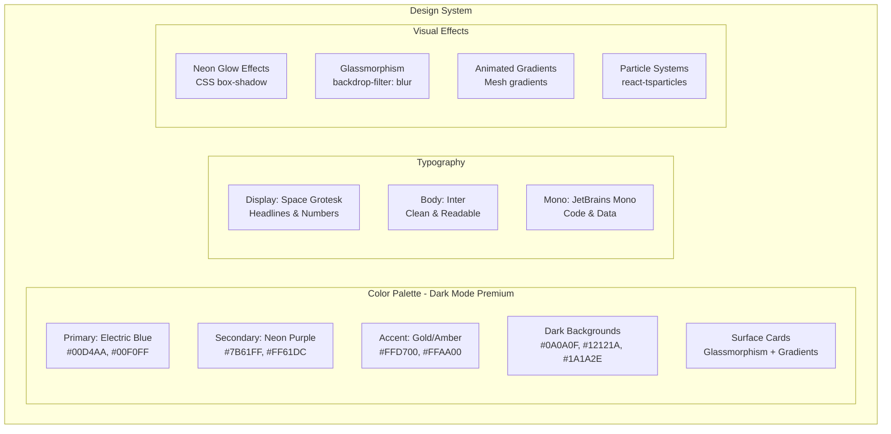

### 11.3 Key UI Components

| Component | Technology | Visual Effect |
|-----------|------------|---------------|
| **Hero Section** | Three.js + React Three Fiber | 3D floating stock market globe with real-time data particles |
| **Portfolio Dashboard** | Recharts + Framer Motion | Animated charts with glowing data points, smooth transitions |
| **AI Analysis View** | CSS Grid + Framer Motion | Holographic cards with scan-line effects, pulsing AI indicators |
| **Asset Cards** | Glassmorphism CSS | Frosted glass with neon borders, hover glow effects |
| **Navigation** | Framer Motion | Morphing menu with liquid transitions |
| **Loading States** | Lottie + CSS | Futuristic spinner with particle trails |
| **Data Tables** | AG Grid + Custom Styling | Glowing row highlights, animated sorting |
| **Notifications** | Framer Motion | Slide-in toasts with gradient backgrounds |

### 11.4 Page-by-Page Experience

#### Landing Page
- **Full-screen 3D visualization** of global markets using Three.js
- **Animated stock tickers** floating in 3D space
- **Neon gradient text** with typewriter effect for headlines
- **Scroll-triggered animations** revealing features
- **Particle network background** connecting data points

#### Dashboard
- **Dark glassmorphism theme** with neon accents
- **Real-time animated charts** with glowing data points
- **3D portfolio pie chart** that rotates on hover
- **Heat map visualization** of asset performance
- **Animated number counters** for portfolio value
- **Live market ticker** with smooth scrolling

#### Portfolio Analysis
- **Holographic AI cards** showing model predictions
- **Animated confidence meters** with liquid fill effects
- **Interactive correlation matrix** with force-directed graph
- **Time-series predictions** with uncertainty bands
- **Attention heatmap** visualization for model explainability

#### Asset Detail View
- **Candlestick charts** with glowing wicks
- **Volume bars** with gradient fills
- **News sentiment gauge** with animated needle
- **Price prediction cone** with confidence intervals
- **Social media sentiment** word cloud

### 11.5 Animation & Interaction Specifications

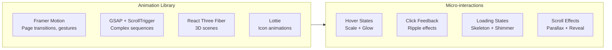

**Animation Timing:**
- Page transitions: 400ms ease-out-expo
- Micro-interactions: 150ms ease-in-out
- Chart animations: 800ms spring physics
- 3D rotations: Continuous 60fps

### 11.6 Responsive Breakpoints

| Breakpoint | Layout Adaptations |
|------------|-------------------|
| Desktop (1440px+) | Full 3D visualizations, multi-column dashboards |
| Laptop (1024px) | Simplified 3D, 2-column layouts |
| Tablet (768px) | 2D charts, collapsible navigation |
| Mobile (375px) | Single column, swipe gestures, bottom nav |

### 11.7 Performance Optimizations

- **Lazy loading** for 3D scenes and heavy visualizations
- **Virtual scrolling** for large data tables
- **Canvas-based charts** for 1000+ data points
- **GPU acceleration** for all animations (transform3d)
- **Code splitting** by route
- **Web Workers** for heavy calculations

### 11.8 Accessibility

- **Reduced motion** support for animations
- **High contrast** mode option
- **Keyboard navigation** for all interactions
- **Screen reader** optimized data tables
- **Color-blind friendly** palettes

## 12. Future Extensibility

- **Multi-User Support**: Current design supports multiple users with isolated portfolios
- **Strategy Plugins**: Quant Engine can support custom alpha strategies
- **Additional Asset Classes**: Easy to add commodities, forex, etc.
- **ML Model Serving**: Can integrate model serving infrastructure for production predictions
- **Real-time Updates**: Can add WebSocket support for live data streaming
- **Federated Learning**: Train models across distributed data sources
- **Neural Architecture Search**: AutoML for finding optimal model architectures
- **VR/AR Dashboards**: Extend 3D visualizations to VR/AR experiences
